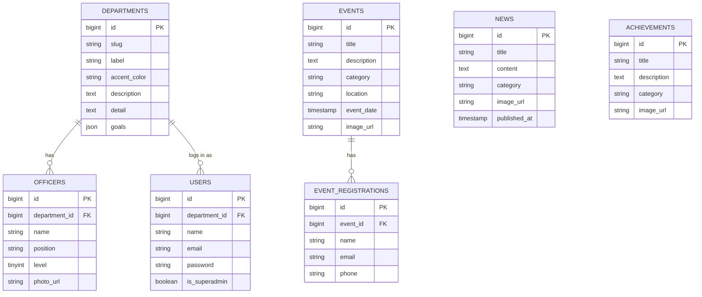
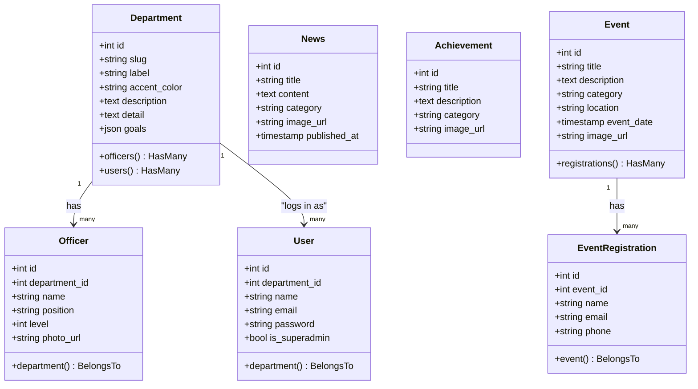

# IEEE SB Telkom University — Backend Spec (Laravel + Supabase Postgres)

Dokumen ini merangkum kesepakatan struktur backend untuk website IEEE SB Telkom University, sebagai acuan tim BE.

## Stack

- **Framework**: Laravel + Laravel Sanctum (auth token-based, SPA)
- **Database**: PostgreSQL, di-host di Supabase (dipakai sebagai managed DB saja — bukan Supabase Auth/Realtime)
- **Storage**: Supabase Storage (bucket `ieee-media`, public) diakses via REST API dari Laravel — bukan local disk
- **Frontend yang dilayani**: React (Vite) situs public + CMS admin (React terpisah)

## Daftar fitur

### Public (tanpa login)

| Fitur | Endpoint | Keterangan |
|---|---|---|
| List berita + filter kategori + pagination | `GET /api/news` | Query param `category`, `page` |
| Detail berita | `GET /api/news/{id}` | |
| List achievements per kategori | `GET /api/achievements` | Kategori: Awards / Technical Projects / Member Recognition |
| List events + filter kategori | `GET /api/events` | |
| Detail event | `GET /api/events/{id}` | |
| Form pendaftaran event | `POST /api/events/{id}/register` | Submit ke tabel `event_registrations` |
| List 6 departemen | `GET /api/departments` | |
| Detail departemen (goals + officer list) | `GET /api/departments/{id}` | Termasuk data untuk org-chart |

### Admin CMS (butuh login, Sanctum token)

| Fitur | Endpoint | Keterangan |
|---|---|---|
| Login | `POST /api/login` | |
| Logout | `POST /api/logout` | |
| Current user | `GET /api/user` | |
| CRUD News | `POST/PUT/DELETE /api/news` | + upload gambar ke Supabase Storage |
| CRUD Achievements | `POST/PUT/DELETE /api/achievements` | + upload gambar |
| CRUD Events | `POST/PUT/DELETE /api/events` | + upload gambar |
| CRUD Departments | `PUT /api/departments/{id}` | Edit deskripsi, vision/mission, goals (JSON) |
| CRUD Officers | `POST/PUT/DELETE /api/officers` | Set `level` 0/1/2 untuk posisi org-chart, upload foto |
| Lihat pendaftar event | `GET /api/events/{id}/registrations` | Per event |

## ERD



Catatan relasi:
- `departments → officers`: satu departemen punya banyak officer. Kolom `level` (0 = head, 1 = mid, 2 = member) menentukan posisi kotak di org-chart SVG frontend.
- `departments → users`: satu departemen bisa punya 1 (atau lebih) akun login. Login CMS dilakukan per akun departemen, bukan per individu officer.
- `events → event_registrations`: satu event bisa punya banyak pendaftar.
- `achievements` berdiri sendiri, cukup difilter berdasarkan `category`.
- Semua kolom `image_url` / `photo_url` menyimpan **full public URL dari Supabase Storage**, bukan path lokal.

## Aturan otorisasi (authorization rules)

| Resource | Siapa yang bisa akses |
|---|---|
| News, Achievements, Events | Semua akun departemen yang sudah login (tidak dibatasi kepemilikan) |
| Department profile (deskripsi, vision/mission, goals) | Hanya akun dari departemen itu sendiri yang bisa edit; akun `is_superadmin = true` bisa edit semua departemen |
| Officers | Hanya akun dari departemen itu sendiri yang bisa CRUD officer-nya; akun `is_superadmin = true` bisa CRUD officer semua departemen |

Implementasi di Laravel disarankan pakai **Policy** per model (`DepartmentPolicy`, `OfficerPolicy`), dicek di controller:

```php
public function update(Request $request, Department $department)
{
    $this->authorize('update', $department); // cek di DepartmentPolicy
    // ...
}
```

```php
// app/Policies/DepartmentPolicy.php
public function update(User $user, Department $department): bool
{
    return $user->is_superadmin || $user->department_id === $department->id;
}
```

Pola yang sama dipakai untuk `OfficerPolicy` (cek `officer->department_id` terhadap `user->department_id`).

**Catatan untuk tim BE**: akun dept IT ditandai lewat kolom `is_superadmin` (bukan hardcode cek `slug === 'it'`), supaya kalau kebijakan akses berubah di kemudian hari (misal departemen lain juga diberi akses penuh), tinggal toggle kolom ini tanpa mengubah logic policy.

## Class diagram



## Requirement keamanan (wajib, bukan opsional)

1. **Rate limiting di endpoint login** — maksimal 5 percobaan per menit per kombinasi email+IP.
   ```php
   Route::post('/login', [AuthController::class,'login'])->middleware('throttle:5,1');
   ```
2. **Semua route admin di belakang `auth:sanctum`** — cek satu per satu, jangan sampai ada endpoint CRUD yang lolos tanpa middleware ini.
3. **Token disimpan di httpOnly cookie**, bukan `localStorage`, untuk mengurangi risiko pencurian token lewat XSS. Gunakan pola Sanctum SPA authentication (CSRF cookie + session), bukan bearer token manual di `localStorage`.
4. **CORS di-lock ke domain sendiri** di `config/cors.php` — jangan gunakan wildcard `*` untuk `allowed_origins`.
5. **Tidak ada secret/service key Supabase yang masuk ke kode frontend** — service role key hanya boleh ada di `.env` Laravel, dipakai server-side untuk upload/delete file di Supabase Storage.

## Konteks arsitektur frontend

- Situs public dan CMS admin di-deploy sebagai **2 project Vercel terpisah**, disatukan lewat 1 domain (`ieeetelu.org`) menggunakan Vercel rewrites di project public (proxy transparan ke project CMS pada path `/admin`). Ini karena domain dikelola DTI kampus dan hanya diberikan 1 domain.
- Kontrak API di atas sudah dirancang mengikuti `apiService.js` yang ada di frontend situs public — tim BE bisa langsung acuan struktur endpoint & response shape dari file tersebut.